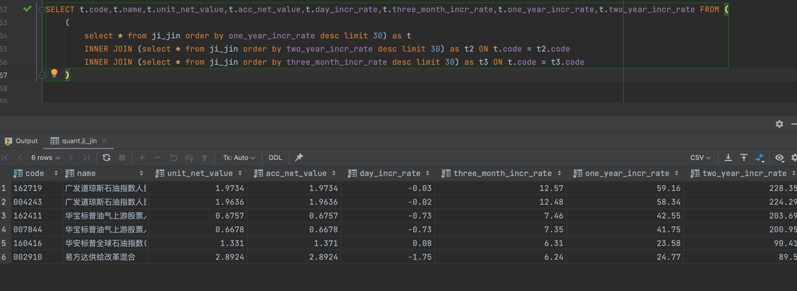

# 量化基金

采集天天基金官网数据，做量化分析

## 启动
core/main.py 直接运行即可

## 数据库
 doc/db.sql 文件是建表语句

## 数据分析
统计所有基金中近三月、近一年、近两年增长率排前 30 的基金，求交集
```sql
SELECT t.code,t.name,t.unit_net_value,t.acc_net_value,t.day_incr_rate,t.three_month_incr_rate,t.one_year_incr_rate,t.two_year_incr_rate FROM (
    (
        select * from ji_jin order by one_year_incr_rate desc limit 30) as t
        INNER JOIN (select * from ji_jin order by two_year_incr_rate desc limit 30) as t2 ON t.code = t2.code
        INNER JOIN (select * from ji_jin order by three_month_incr_rate desc limit 30) as t3 ON t.code = t3.code
    )

```
查询结果

